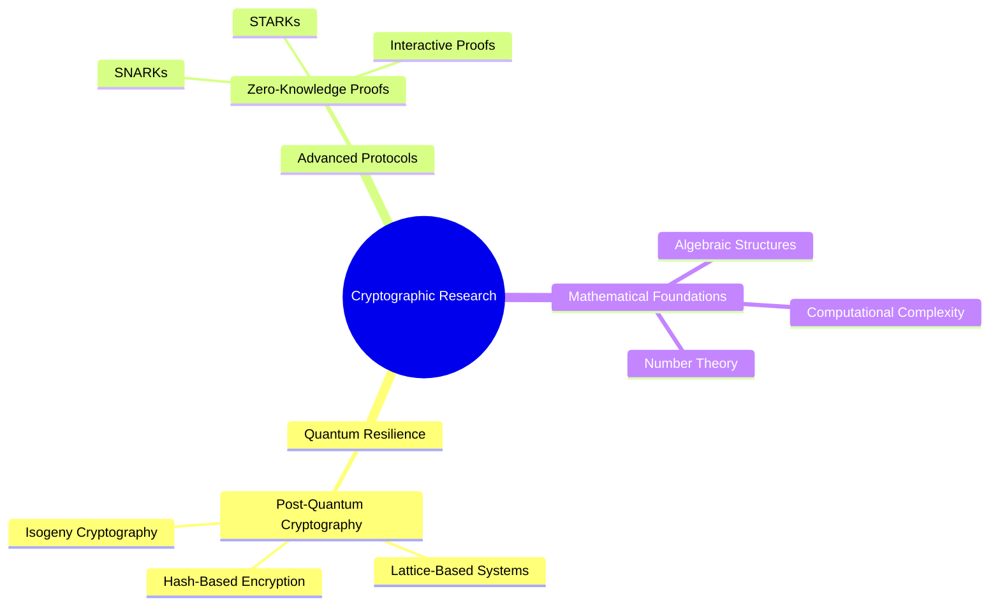

<div align="center">

# CRYPTOGRAPHIC SYSTEMS ARCHITECTURE

```ansi
[48;5;234m[38;5;45m┌─────────────────────────────────────────────────┐[0m
[48;5;234m[38;5;45m│ SECURITY COMPLEXITY: O(IMAGINATION)              │[0m
[48;5;234m[38;5;45m│ ENTROPY REDUCTION IN COMPUTATIONAL DOMAINS       │[0m
[48;5;234m[38;5;45m└─────────────────────────────────────────────────┘[0m
```


## COMPUTATIONAL FRAMEWORK

<table>
<tr>
<td width="60%">

### Research Domain Mapping



</td>
<td width="40%">

### Architectural Abstraction

```python
class SecurityArchitect:
    def __init__(self):
        self.research_vector = {
            "primary_domain": "Quantum Cryptography",
            "research_complexity": "NP-Hard",
            "innovation_potential": 0.9756
        }
    
    def generate_secure_protocol(self):
        """
        Generates advanced cryptographic protocols
        with quantum resilience
        """
        return QuantumSecureProtocol(
            security_level=self.research_vector['innovation_potential']
        )
```

</td>
</tr>
</table>

## COMPUTATIONAL METRICS

<div align="center">
  
</div>

<table>
<tr>
<td width="50%">

### Performance Analysis


</td>
<td width="50%">

### Contribution Topology


</td>
</tr>
</table>

## TECHNOLOGICAL ECOSYSTEM

<div align="center">

| Quantum Computing | Classical Computation | Mathematical Tools |
|:---:|:---:|:---:|
|  |  |  |
|  |  |  |

</div>

## RESEARCH PROJECTIONS

<div align="center">
  
[](https://github.com/crypt0-wizard/quantum-resistant-cryptography)
[](https://github.com/crypt0-wizard/zero-knowledge-protocols)

</div>

## PROFESSIONAL NETWORK

<div align="center">

[](https://crypt0-wizard.github.io)
[](https://scholar.google.com)
[](https://linkedin.com)

</div>


## CRYPTOGRAPHIC SIGNATURE

<details>
<summary>🔐 Secure Communication Fingerprint</summary>

```pgp
-----BEGIN PGP PUBLIC KEY BLOCK-----
[Quantum-Enhanced Cryptographic Signature]
-----END PGP PUBLIC KEY BLOCK-----
```

</details>

</div>
