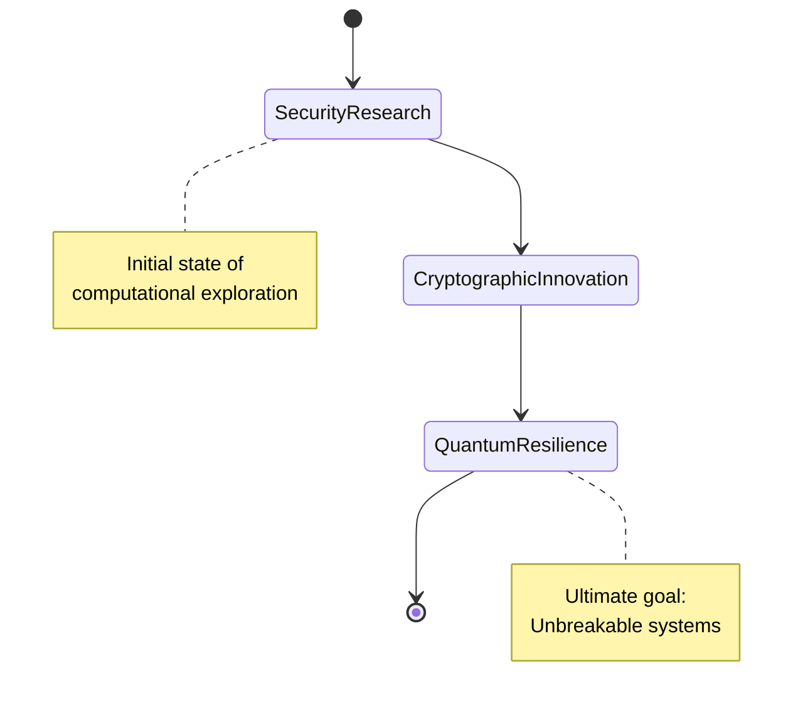
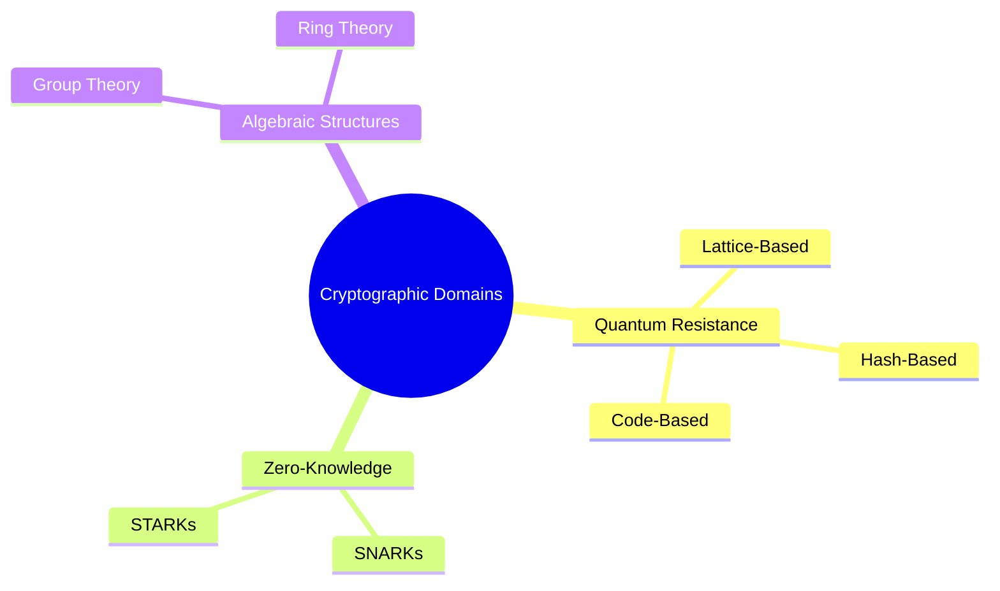

<div align="center">

# ∄ crypt0-wizard : Computational Domain

```ansi
[0;34m╔══════════════════════════════════════════════════════╗[0m
[0;34m║[0;36m  Computational Complexity: [0;33mO(Imagination)[0;34m               ║[0m
[0;34m║[0;36m  Entropy Reduction in Security Paradigms         [0;34m║[0m
[0;34m╚══════════════════════════════════════════════════════╝[0m
```


## Computational Eigenvector

<table>
<tr>
<td width="50%">

### 🔬 Quantum State Representation



</td>
<td width="50%">

### 🧮 Mathematical Transform

```python
class QuantumCryptographer:
    def __init__(self):
        self.quantum_state = {
            "complexity": "NP-Hard",
            "research_vector": [
                "Post-Quantum Cryptography",
                "Zero-Knowledge Protocols",
                "Homomorphic Encryption"
            ]
        }
    
    def generate_security_proof(self, system):
        """
        Generates a cryptographic proof 
        with quantum resilience
        """
        return ProofSystem(
            security_level=self.quantum_state['complexity'],
            research_domains=self.quantum_state['research_vector']
        )
```

</td>
</tr>
</table>

## Computational Metrics

<div align="center">
  
</div>

<table>
<tr>
<td width="50%">

### 🔍 Research Topology



</td>
<td width="50%">

### 📊 Complexity Analysis


</td>
</tr>
</table>

## Technological Eigenspace

<div align="center">

| Quantum Computing | Classical Computation | Mathematical Tools |
|:---:|:---:|:---:|
|  |  |  |
|  |  |  |

</div>

## Cryptographic Projections

<div align="center">
  
[](https://github.com/crypt0-wizard/quantum-resistant-cryptography)
[](https://github.com/crypt0-wizard/zero-knowledge-protocols)

</div>

## Computational Network

<div align="center">

[](https://scholar.google.com)
[](https://linkedin.com)
[](https://crypt0-wizard.github.io)

</div>


## Quantum Entanglement Signature

<details>
<summary>🔐 Cryptographic Fingerprint</summary>

```pgp
-----BEGIN PGP PUBLIC KEY BLOCK-----
[Quantum-Secured Public Key Representation]
-----END PGP PUBLIC KEY BLOCK-----
```

</details>

</div>
