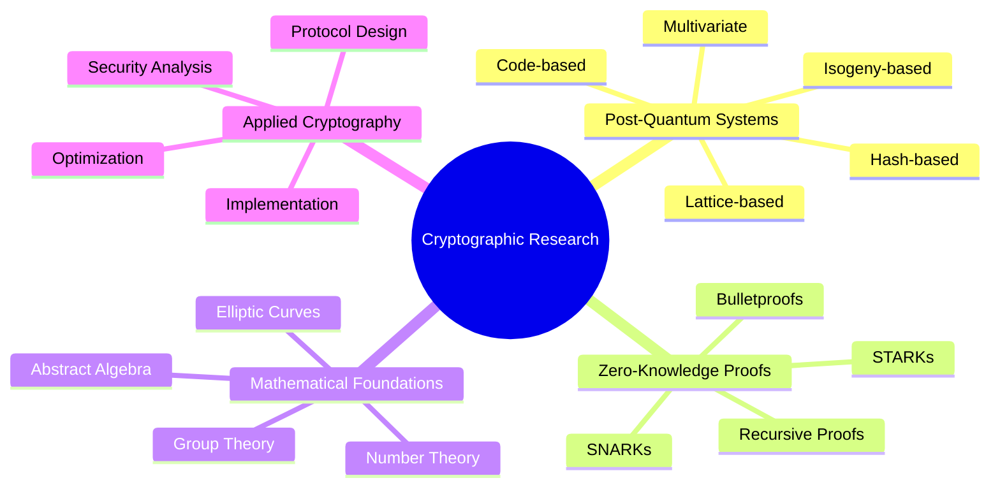

<div align="center">

```ascii-art
⠀⠀⠀⠀⠀⠀⢸⠓⢄⠀⠀⠀⠀⠀⠀⠀⠀⠀⠀⠀⠀⠀⠀⠀⠀⠀⠀⠀⠀⠀
⠀⠀⠀⠀⠀⠀⢸⠀⠀⠑⢄⠀⠀⠀⠀⠀⠀⠀⠀⠀⠀⠀⠀⠀⠀⠀⠀⠀⠀⠀    ∮ E⋅da = Q / ε₀
⠀⠀⠀⠀⠀⠀⢸⠀⠀⠀⠀⠑⢄⠀⠀⠀⠀⠀⠀⠀⠀⠀⠀⠀⠀⠀⠀⠀⠀⠀    ∇ × B = μ₀(J + ε₀∂E/∂t)
⠀⠀⠀⠀⠀⠀⢸⠀⠀⠀⠀⠀⠀⠑⢄⠀⠀⠀⠀⠀⠀⠀⠀⠀⠀⠀⠀⠀⠀⠀    Where Mathematics Transcends Reality
⠀⠀⠀⠀⠀⠀⢸⠀⠀⠀⠀⠀⠀⠀⠀⠑⢄⠀⠀⠀⠀⠀⠀⠀⠀⠀⠀⠀⠀⠀
⠀⠀⠀⠀⠀⠀⢸⠀⠀⠀⠀⠀⠀⠀⠀⠀⠀⠑⢄⠀⠀⠀⠀⠀⠀⠀⠀⠀⠀⠀
```

<a href="https://github.com/crypt0-wizard">
  
</a>

[](https://git.io/typing-svg)

</div>

<div align="center">
  
</div>

## ⚡ Quantum Metrics

<table>
<tr>
<td width="50%">


</td>
<td width="50%">


</td>
</tr>
</table>

## 🔮 Research Dimensions

<details>
<summary>Click to expand research areas</summary>



</details>

## 🧮 Technical Arsenal

<table align="center">
<tr>
<td align="center" width="96">
  
  <br>Python
</td>
<td align="center" width="96">
  
  <br>C++
</td>
<td align="center" width="96">
  
  <br>Rust
</td>
<td align="center" width="96">
  
  <br>Haskell
</td>
<td align="center" width="96">
  
  <br>Git
</td>
<td align="center" width="96">
  
  <br>LaTeX
</td>
</tr>
</table>

## 🎯 Core Research Areas

<table align="center">
<tr>
<td width="50%">

### 🌌 Post-Quantum Cryptography


```python
def generate_lattice_params(n, q):
    """Generate LWE parameters"""
    A = random_matrix(Zmod(q), n, n)
    s = random_vector(Zmod(q), n)
    e = small_error_vector(n)
    return A, A*s + e
```

</td>
<td width="50%">

### 🔍 Zero-Knowledge Systems


```python
def generate_proof(circuit, witness):
    """Generate ZK proof"""
    params = setup(circuit)
    proof = prove(params, circuit, witness)
    return proof, verify(params, proof)
```

</td>
</tr>
</table>

## 📚 Featured Publications & Projects

<div align="center">
  
[](https://github.com/crypt0-wizard/quantum-resistant-crypto)
[](https://github.com/crypt0-wizard/zk-proof-systems)
[](https://github.com/crypt0-wizard/lattice-based-crypto)
[](https://github.com/crypt0-wizard/isogeny-cryptography)

</div>

## 🌐 Research Network & Contributions

<div align="center">
  <a href="https://crypt0-wizard.github.io">
    
  </a>
  <a href="https://scholar.google.com">
    
  </a>
  <a href="https://linkedin.com">
    
  </a>
  <a href="https://twitter.com">
    
  </a>
</div>

<div align="center">
  
</div>

<details>
<summary>🔒 PGP Public Key</summary>

```
-----BEGIN PGP PUBLIC KEY BLOCK-----
[Your PGP public key here]
-----END PGP PUBLIC KEY BLOCK-----
```

</details>
